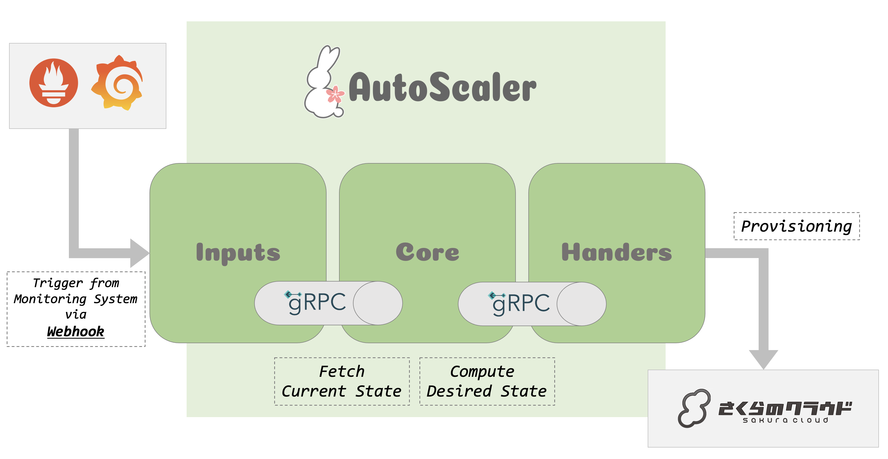

# AutoScaler

[sacloud/autoscaler](https://github.com/sacloud/autoscaler) はさくらのクラウド上のリソースのオートスケーリングを行うためのツールです。

## Overview

sacloud/autoscalerはGrafanaやAlertManagerなどの監視ツールからのWebhookを受け、あらかじめ定義しておいたコンフィギュレーションに沿ってさくらのクラウド上のリソースのオートスケールを行います。  
オートスケールに際し、サーバの上流にロードバランサが存在する場合はロードバランサからのデタッチ/アタッチも行います。

以下のオートスケーリングに対応しています。

### Handlers

#### 垂直スケール系

- `elb-vertical-scaler`: エンハンスドロードバランサの垂直スケール(CPSの変更)
- `router-vertical-scaler`: ルータの垂直スケール(帯域幅の変更)
- `server-vertical-scaler`: サーバの垂直スケール(CPU/メモリサイズの変更)
  
#### アタッチ/デタッチ系

- `elb-servers-handler`: エンハンスドロードバランサ配下のサーバのデタッチ/アタッチ
- `gslb-servers-handler`: GSLB配下のサーバのデタッチ/アタッチ
- `load-balancer-servers-handler`: LB配下のサーバのデタッチ/アタッチ
  
- `dns-servers-handler`: サーバが水平スケールする際のAレコード登録/削除
  
#### 水平スケール系

- `server-horizontal-scaler`: サーバの水平スケール

## Getting Started

[Getting Started Guide](https://docs.usacloud.jp/autoscaler/getting_started/)を参照してください。

## License

`sacloud/autoscaler` Copyright (C) 2021-2023 The sacloud/autoscaler Authors.

This project is published under [Apache 2.0 License](LICENSE.txt).
