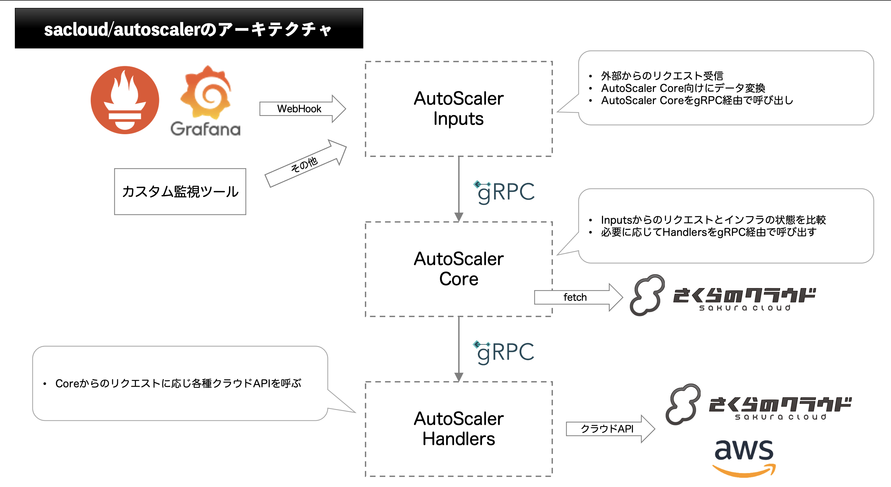

# sacloud/autoscalerの実装

## Overview

さくらのクラウドでのオートスケールをサポートするためのツール群を提供する。  

## Goals

- スケールアップ/ダウン(垂直スケール)に対応する
  - エンハンスドロードバランサ(CPS)
  - ルータ(帯域幅)
  - サーバ(CPU/メモリ)
    
- スケールアウト/イン(水平スケール)に対応する
  - サーバ
  - GSLB

- プラガブルなインプット/ハンドラー
  さまざまなデータソースとの連携やカスタマイズ可能な構成方法をとるためにプラガブルな構成とする
  - トリガーのインプットとしてGrafana/Alert Manager(Prometheus)のWebHook
  - Composableなアウトプット: 例 -> サーバの増設 + DNSレコード登録

## 将来的に実装を考えている機能

- エンハンスドロードバランサのスケールアウト/イン

## 実装方針

### 主要コンポーネント

- Inputs: Webhookなどでオートスケールリクエストを受け取りCoreをトリガーする
- Core: リクエスト/現在のインフラの状態(さくらのクラウドAPIから取得)/設定値からあるべき状態(Desired)を決定、Handlersを呼び出す
- Handlers: Add/Deleteなどのリクエストを受け、各種クラウドAPIを呼び出しインフラのプロビジョニングを行う

### Inputs

- Grafana Inputs: GrafanaのアラートをWebHook経由で受け取る
- AlertManager Inputs: PrometheusのAlertManagerからのアラートをWebHook経由で受け取る
- Scheduled Inputs: 任意のスケジュール(cronなど)で起動する
- File Watcher Inputs: 任意のファイルの変更を契機に起動する

共通部分(gRPC経由でのCoreの呼び出しなど)をライブラリとして切り出して提供する

### Handlers

- Server Horizontal Scaler: サーバ数を任意の数までスケールアウト/インする
- Server Vertical Scaler: サーバのスペックを任意の状態へスケールアップ/ダウンする
- DNS A Record Handler: さくらのクラウドDNSへ任意のAレコードを登録/削除する
- DNS CNAME Record Handler: さくらのクラウドDNSへ任意のCNAMEレコードを登録/削除する
- Shell Exec Handler: 任意のスクリプト(など)を実行する。パラメータは標準入力経由でJSON形式で渡される

さくらのクラウドだけでなく、Route53などを併用するパターンも考えられる。  
このためShell Exec Handlerなどのような汎用的に処理できる仕組みが必要となる。  

#### Handlersの組み合わせ

Handlersは設定により任意の組み合わせを行えるようにする。複数のHandlersが指定された場合パイプラインとして順次処理していく。  
Core -> Handlersでやりとりされる情報にコンテキストデータを持たせハンドラーのパイプライン間で受け渡せるようにしておく。