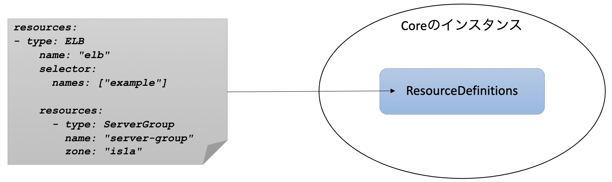
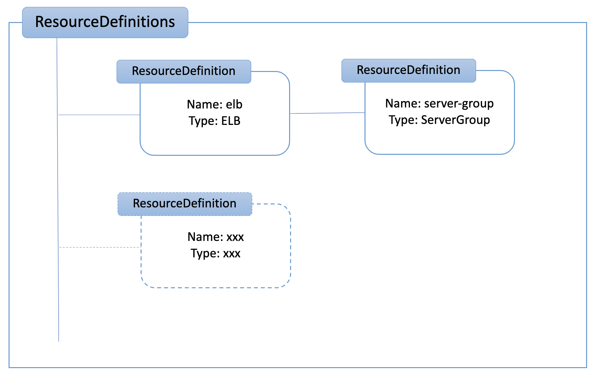
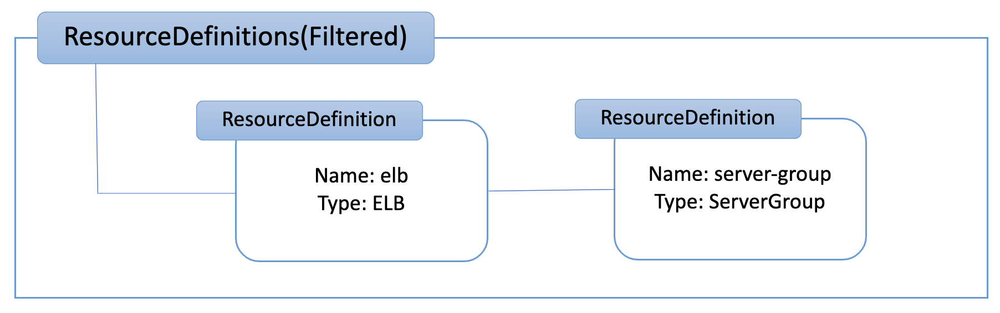
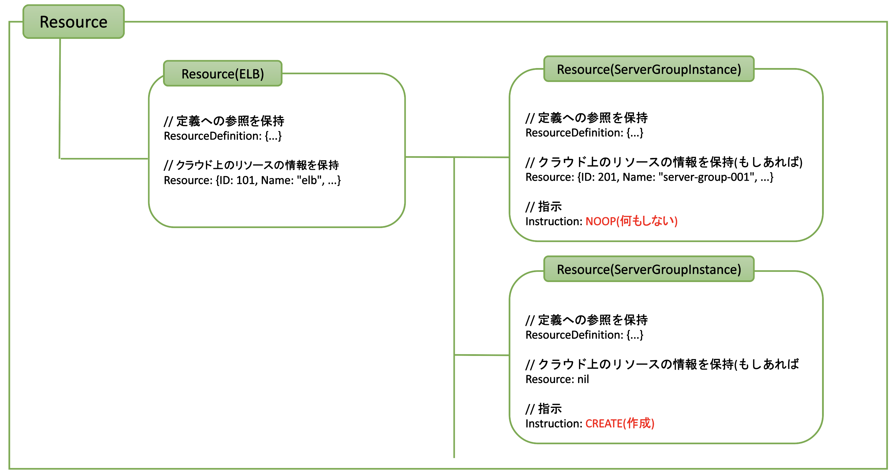
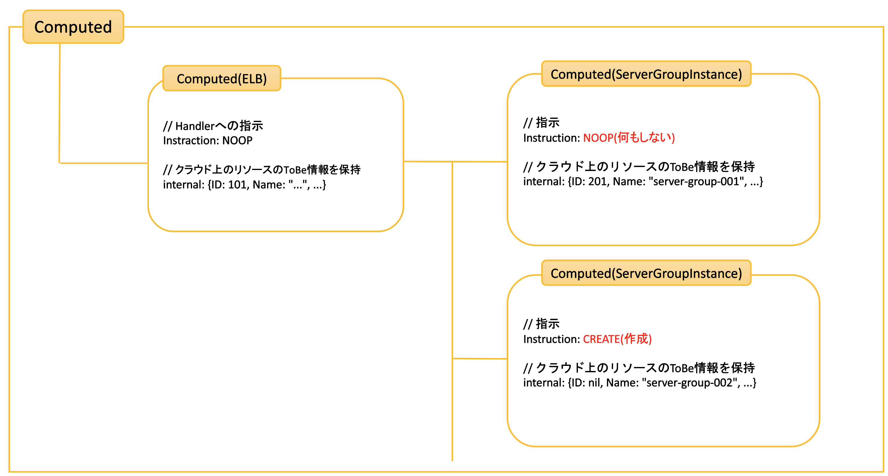
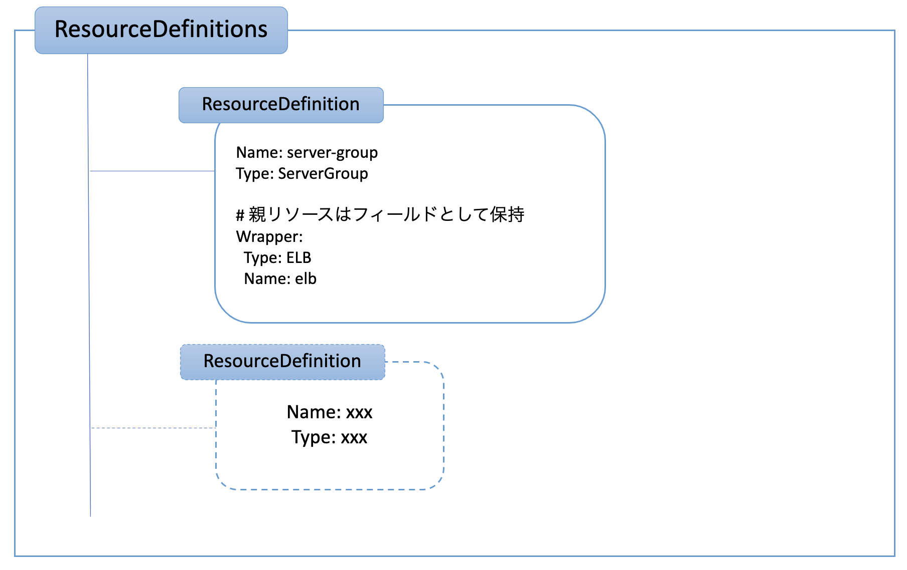
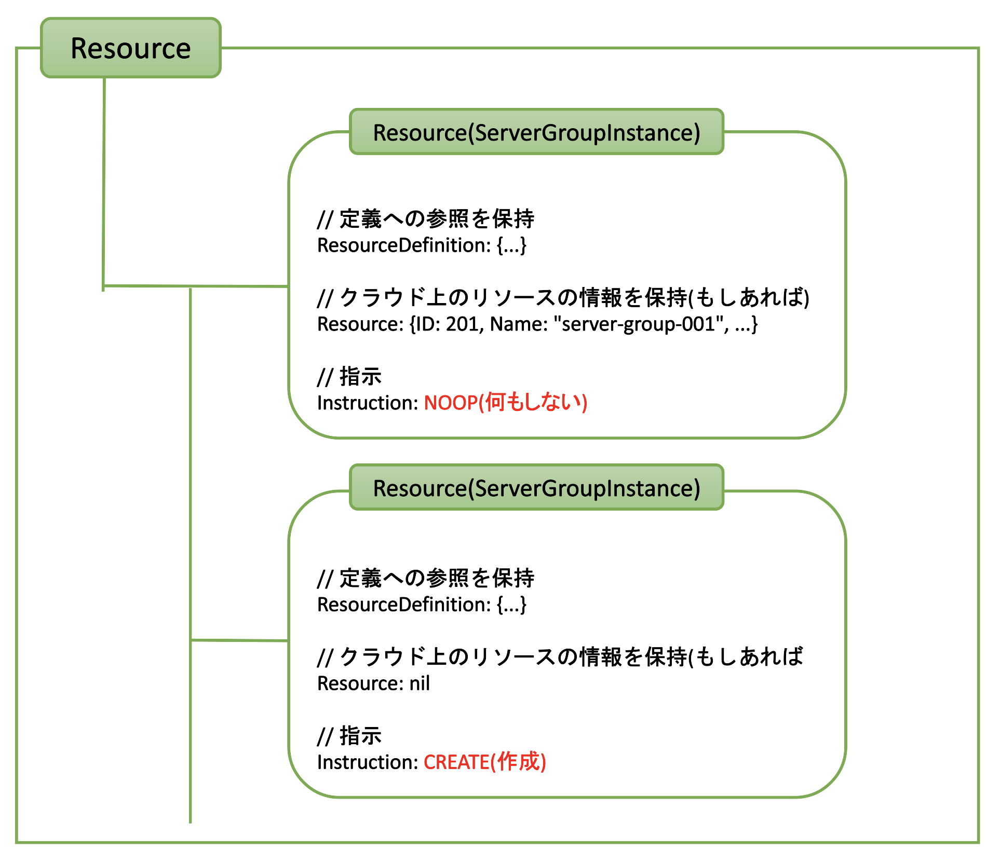
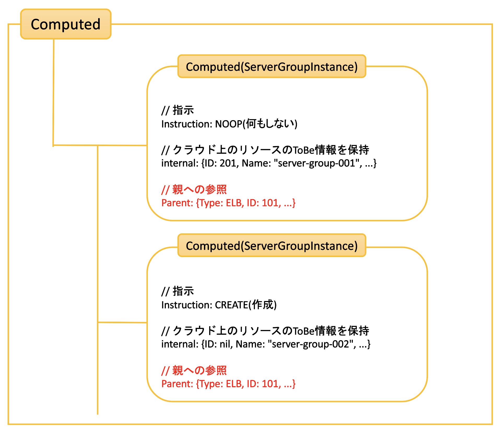

# コンフィギュレーションでのリソースの親子関係の定義

- URL: https://github.com/sacloud/autoscaler/issues/282
- Author: @yamamoto-febc

## 概要

コンフィギュレーションでのリソースの親子関係の定義方法を見直し、よりシンプルに記載可能にする。

v0.5以前は論理的なリソースの親子関係をそのままの形でコンフィギュレーション上に定義していた。

As-Is:
```yaml
resources:                 
  - type: ELB               # 親リソースの定義
    name: "elb" 
    selector:
      names: ["example"]
      
    resources:              # 親リソースのresources配下に子リソースを定義
    - type: ServerGroup
      name: "server-group" 
      zone: "is1a"
```

この定義方法は論理的な親子関係がわかりやすいというメリットがある一方、
親リソースはスケールさせたくない場合でも通常のスケール対象リソースと同様に定義する必要があるといったデメリットも存在する。  
また、親リソースもスケール対象リソースであることで`name`が省略できないといった副次的なデメリットも存在する。

このためv0.5では親子関係の定義方法を見直し、スケールさせたいリソースのフィールドとして親リソースを定義する方法を取る。

To-Be:
```yaml
resources:                 # スケールさせたいリソースをresources直下に定義していく
  - type: ServerGroup
    # name: "server-group" # スケールさせたいリソースが1つだけならnameを省略できる
    zone: "is1a"
    
    parent:                # 親リソースの定義
      type: ELB               
      selector:
        names: ["example"]
                           # 親リソース側にはnameを指定する必要なし
```

## v0.4での実装/大まかな流れ

コンフィギュレーションからリソースグラフを構築し、各要素を辿りながら逐次処理している。
処理の流れは以下の通り。

- Coreの起動時
    - step1: YAMLからコンフィギュレーションをロード、ResourceDefinitionsとして保持
- Up/Downリクエスト受信時
    - step2-1: リクエストされたリソース名から対象のResourceDefinitionsを抽出
    - step2-2: ResourceDefinitionからResourceを算出
    - step2-3: ResourceごとにComputedを算出
    - step2-4: ハンドラ呼び出し(PreHandle/Handle/PostHandle)

### データの流れのイメージ(As-Is)

#### step1: コンフィギュレーションのロード



ロード後のResourceDefinitions:



#### Step2-1: リクエストされたリソース名から対象のResourceDefinitionsを抽出

Up/Downリクエスト時に指定されたリソース名を元に、どのリソース定義が対象か特定しResourceDefinitions内の該当ツリーだけにフィルタする


  
#### Step2-2: フィルタされたResourceDefinitionsのそれぞれの要素からResourceを算出



#### Step2-3: ResourceごとにComputedを算出

各ResourceごとにComputedを算出する。Computedにはハンドラへの指示内容や対象リソースのToBe情報を保持する。  
算出処理の順番はツリーの末端からとなる。


#### Step2-4: ハンドラ呼び出し(PreHandle/Handle/PostHandle)

ハンドラのPreHandle/Handle/PostHandleを呼び出す。



## v0.5以降での実装(To-Be)

以下を修正する。

- 親リソースを表す`ParentResourceDef`を新設
- `ParentResourceDef`はリソースタイプごとに適切な`Computed`を返すように実装
  - 従来の`ResourceDefxxx`のうち、スケール対象ではないものを除去(DNS/GSLB/LBなど)、`ParentResourceDef`が代わりとなる

処理の流れと関連する修正点は以下の通り。

- Step1: 
  - ResourceDefinitionsの直下にはスケールさせたいリソースだけを直接保持する
    (スケール対象出ない親リソースは直下には保持しない)
  - 親リソースがある場合は各ResourceDefinitionの`parent`フィールドとして表現する
- Step2-1:
  - 指定されたリソース名に対応するResourceDefinitionのみ返す
    (従来は該当定義が所属するツリーを返していた)
- Step2-2〜:
  - 大きな変更はなし、ただしStep1の変更により処理対象のResourceが階層構造ではなくなった

### 修正後のイメージ

#### ResourceDefinitionsやResourcesはツリーではなくフラットに





#### 親が定義されている場合、Computedには親の情報を保持する



### 更新内容

- 2022/2/16: 初版
- 2022/2/17: フィールド名変更: `wrapper`から`parent`へ
- 2022/2/24: 
    - ResourceDefinitionGraphを除去 - 最終的な実装では採用しなかったため
    - Computed周りの図を追加