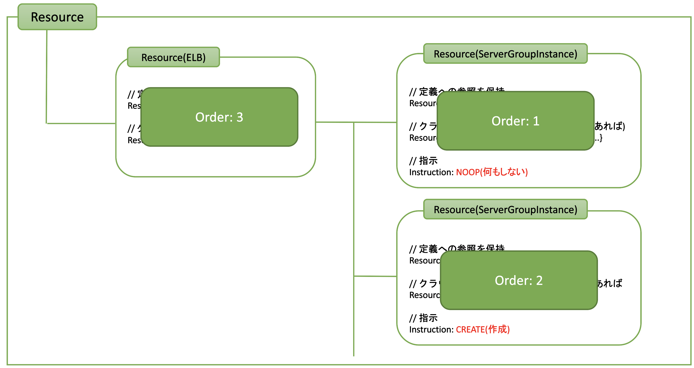

# コンフィギュレーションでのリソースの親子関係の定義

- URL: https://github.com/sacloud/autoscaler/issues/282
- Author: @yamamoto-febc

## 概要

コンフィギュレーションでのリソースの親子関係の定義方法を見直し、よりシンプルに記載可能にする。

従来は論理的なリソースの親子関係をそのままの形でコンフィギュレーション上に定義していた。

As-Is:
```yaml
resources:                 
  - type: ELB               # 親リソースの定義
    name: "elb" 
    selector:
      names: ["example"]
      
    resources:              # 親リソースのresources配下に子リソースを定義
    - type: ServerGroup
      name: "server-group" 
      zone: "is1a"
```

この定義方法は論理的な親子関係がわかりやすいというメリットがある一方、
親リソースはスケールさせたくない場合でも通常のスケール対象リソースと同様に定義する必要があるといったデメリットも存在する。  
また、親リソースもスケール対象リソースであることで`name`が省略できないといった副次的なデメリットも存在する。

このため親子関係の定義方法を見直し、スケールさせたいリソースのフィールドとして親リソースを定義する方法にすることでよりシンプルな形を目指す。

To-Be:
```yaml
resources:                 # スケールさせたいリソースをresources直下に定義していく
  - type: ServerGroup
    # name: "server-group" # スケールさせたいリソースが1つだけならnameを省略できる
    zone: "is1a"
    
    wrapper:               # 親リソースの定義
      type: ELB               
      selector:
        names: ["example"]
                           # 親リソース側にはnameを指定する必要なし
```

## 現在の実装/大まかな流れ

現在はコンフィギュレーションからリソースグラフを構築し、各要素を辿りながら逐次処理している。
処理の流れは以下の通り。

- Coreの起動時
    - step1: YAMLからコンフィギュレーションをロード、ResourceDefinitionsとして保持
- Up/Downリクエスト受信時
    - step2-1: リクエストされたリソース名から対象のResourceDefinitionsを抽出
    - step2-2: ResourceDefinitionからResourceを算出
    - step2-3: Resourceごとにハンドラ呼び出し(PreHandle/Handle/PostHandle)

### データの流れのイメージ(As-Is)

#### step1: コンフィギュレーションのロード


ロード後のResourceDefinitions:


#### Step2-1: リクエストされたリソース名から対象のResourceDefinitionsを抽出

Up/Downリクエスト時に指定されたResourceNameを元に、どのリソース定義が対象か特定しResourceDefinitions内の該当ツリーだけにフィルタする


#### Step2-2: フィルタされたResourceDefinitionsのそれぞれの要素からResourceを算出


#### Step2-3: Resourceごとにハンドラ呼び出し(PreHandle/Handle/PostHandle)

各ResourceごとにハンドラのPreHandle/Handle/PostHandleを呼び出す。
順番はツリーの末端からとなる。


## 実装(To-Be)

以下を修正する。

- Step1: 
  - ResourceDefinitionsの直下にはスケールさせたいリソースを直接保持する
  - 親リソースがある場合は各ResourceDefinitionのフィールドとして表現する
- Step2-1:
  - リクエストされたリソース名で特定したResourceDefinitionからResourceDefinitionGraphを算出(新設)
  - Step2-2以降にはResourceDefinitionGraphを渡す

#### Step1の修正後のイメージ


#### Step2-1の修正後のイメージ


### 更新内容

- 2022/2/16: 初版