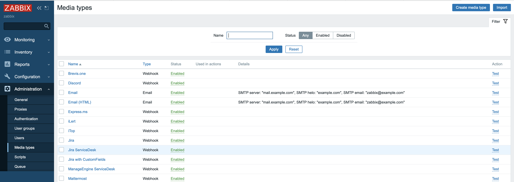
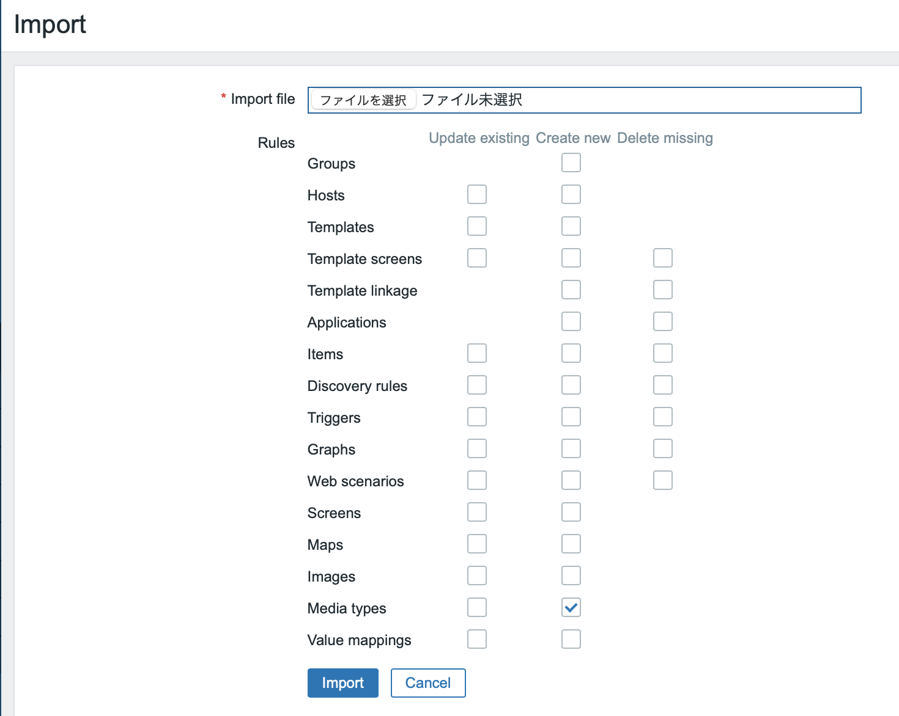
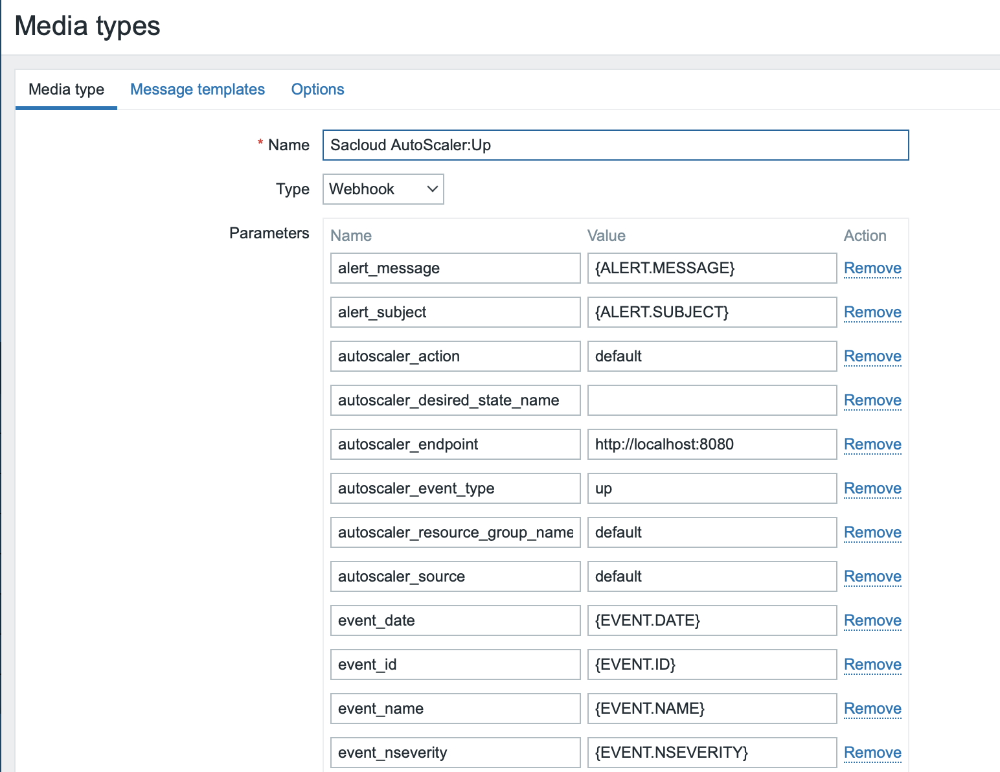
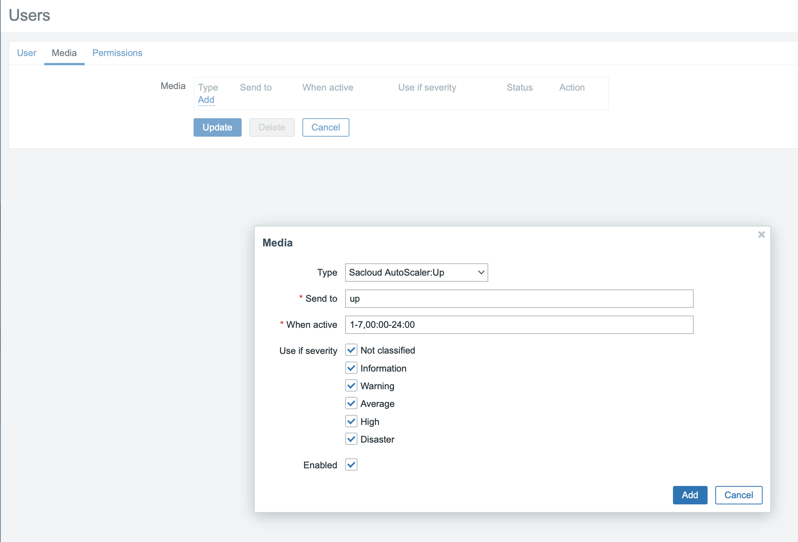
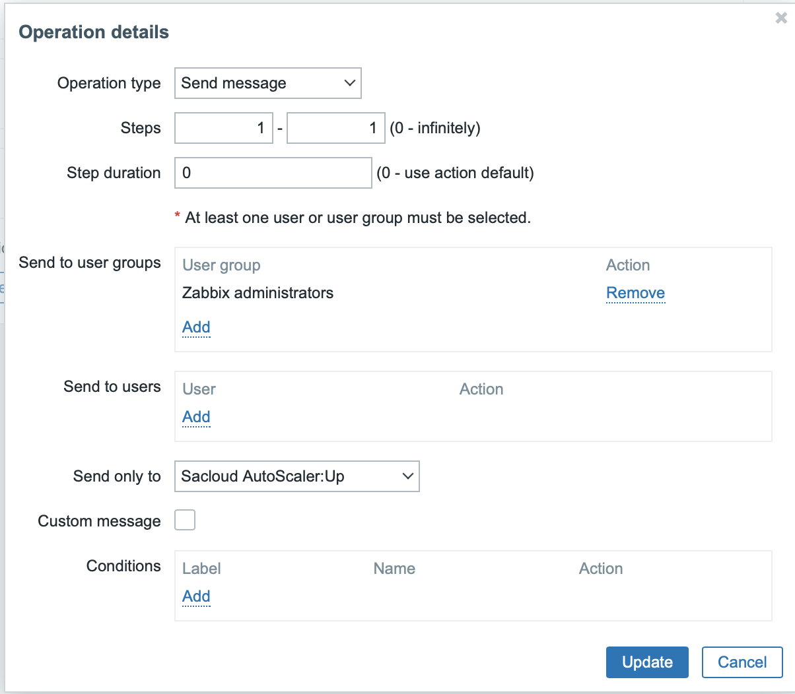

# Zabbix Inputs

Zabbixを利用する場合の設定について記載します。

## 前提条件

- ZabbixからZabbix Inputsへのネットワーク疎通が可能なこと
- Zabbix InputsからAutoScaler Coreへの疎通が可能なこと
- Zabbix 5.0以降であること(動作確認は5.0で行なっています)

## Media typesのインポート/設定

### Media typesのインポート

まずZabbixの管理画面からZabbix Inputs用のMedia typesを2つインポートします。  

メニューの`Administration` - `Media types`を開き、右上の`Import`ボタンをクリックします。  

次に`Media types`の`Create new`だけにチェックを入れ、`autoscaler_up.xml`を選択しImportボタンをクリックします。  
同様に`autoscaler_down.xml`もインポートしてください。

### Media typesの設定

次にインポートしたMedia typesの設定画面を開きます。  

以下の項目を必要に応じて編集してください。

- `autoscaler_endpoint`: Zabbix Inputsのエンドポイント
- `autoscaler_source`: リクエスト元を識別するための名称。任意の値を利用可能。デフォルト値:`default`
- `autoscaler_action`: 実行するアクション名。Coreのコンフィギュレーションで定義したアクション名を指定する。デフォルト値:`default`
- `autoscaler_resource_group_name`: 操作対象のリソースグループの名前。Coreのコンフィギュレーションで定義したグループ名を指定する。デフォルト値:`default`
- `autoscaler_desired_state_name`: 希望する状態の名前。Coreのコンフィギュレーションで定義したプラン名を指定する。特定の時刻に特定のスペックにしたい場合などに利用する。デフォルト値:`""`  

## ユーザーへのMediaの追加

次に任意のユーザーに対し先程インポートしたMedia typeのMediaを追加します。  

管理画面から任意のユーザーの編集画面を開き、先程インポートした2つのMediaを追加してください。  
`Send to`は必須ですがAutoScalerでは利用しませんので任意の値を入力してください。

後は任意のアクションで、インポートした2つのMedia typesのいずれかに対し`Send Message`オペレーションを追加します。  

## 注意点

Zabbix Inputsはエンドポイントに対しPOSTリクエストがあったら処理を行います。この際にリクエストボディは読まれません。  
外部からは隔離された監視用ネットワーク上で起動するなどでエンドポイントの保護を別途行なってください。

Zabbix Inputsのエンドポイントの保護が難しい場合はZabbixのRemote commandとDirect Inputsを組み合わせる方法もご検討ください。  

## TLS関連設定

[Inputs共通設定](../tls_config.md)を参照ください。  